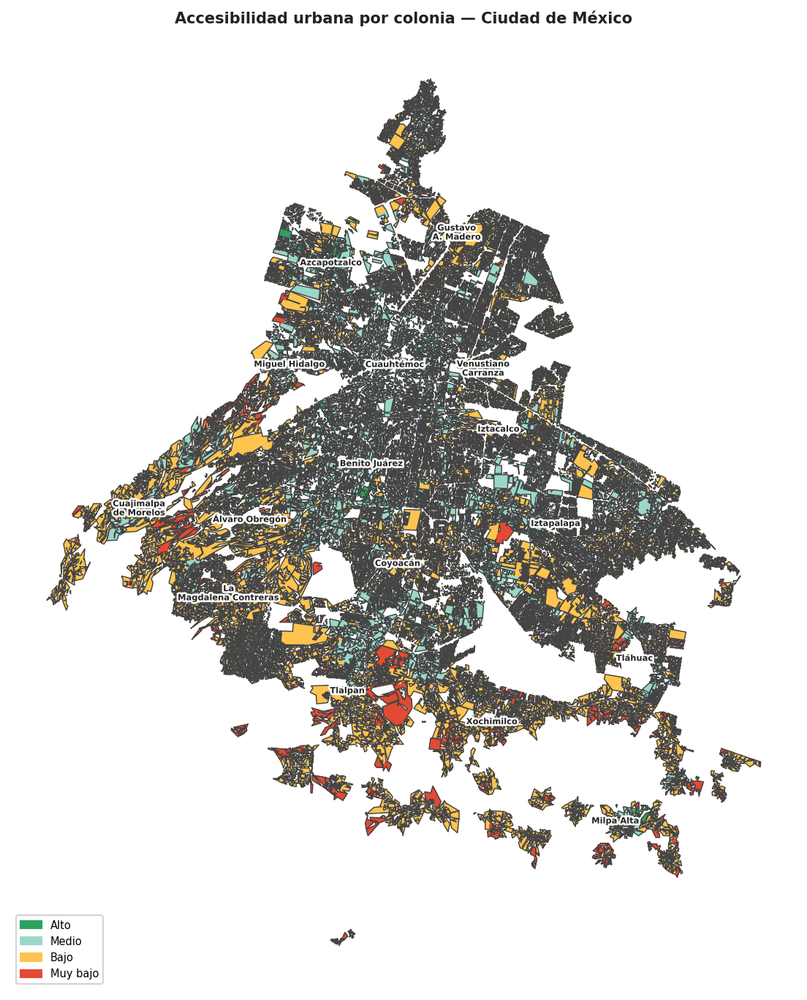
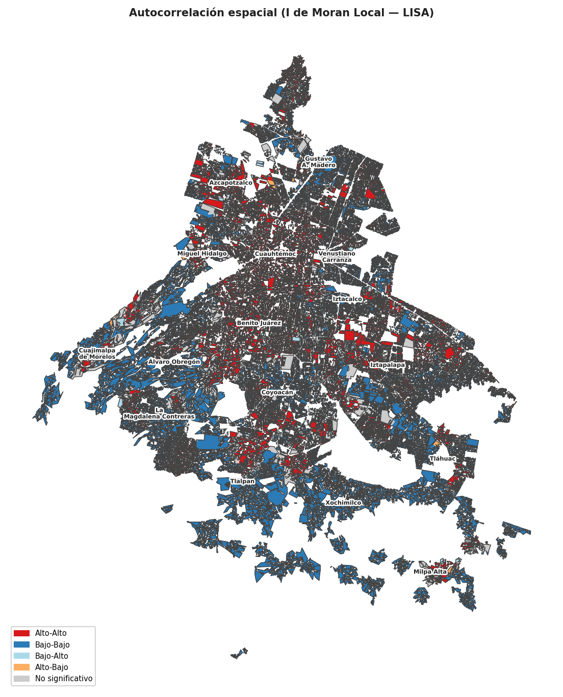

```{python}
import pandas as pd
import json
import plotly.graph_objects as go
import geopandas as gpd
import folium

# ── Carga de datos ODS 11 ─────────────────────────────────────────────────────
with open("datos/ods11_final.json", "r") as f:
    ods = json.load(f)

ODS_TITULOS = [
    "11.1.1 — Viviendas Precarias (%)",
    "11.2.1 — Acceso a Transporte Público (%)",
    "11.3.1 — Relación de Expansión del Suelo",
    "11.r.2.1a — Tiempo de Traslado al Trabajo (min)",
    "11.6.1.a — Residuos Sólidos Gestionados (%)",
    "11.6.2.a — Partículas PM2.5",
    "11.6.2.b — Partículas PM10",
    "11.4.1 — Gasto en Patrimonio Cultural ($)",
    "11.7.1 — Espacios Públicos (%)",
    "11.r.2.1b — Traslado de Población Indígena (min)",
]

ODS_TABS = [
    "11.1.1", "11.2.1", "11.3.1", "11.r.2.1a",
    "11.6.1.a", "11.6.2.a", "11.6.2.b",
    "11.4.1", "11.7.1", "11.r.2.1b",
]

# ── Paleta ────────────────────────────────────────────────────────────────────
COLOR_CDMX  = "#bc80bd"  # Set3 purple — distinto del header #fb8072
COLOR_OTROS = "#80b1d3"
COLOR_NAC   = "#fdb462"

# ── Funciones de utilidad ─────────────────────────────────────────────────────
def get_val(substr):
    ind = next(x for x in ods if substr in x["nombre"])
    cdmx = next(d["valor"] for d in ind["datos"] if d["cvegeo"] == "09")
    return cdmx, ind["nacional"], ind["nombre"]

val_viv, nac_viv, _ = get_val("11.1.1")
val_tra, nac_tra, _ = get_val("11.2.1")
val_tme, nac_tme, _ = get_val("11.r.2.1a")
val_esp, nac_esp, _ = get_val("11.7.1")

def make_ods_chart(idx: int, height: int = 430) -> go.Figure:
    ind = ods[idx]
    datos_s = sorted(ind["datos"], key=lambda d: d["valor"], reverse=True)
    fig = go.Figure()
    fig.add_trace(go.Bar(
        x=[d["valor"] for d in datos_s],
        y=[d["cvegeo"] for d in datos_s],
        orientation="h",
        marker_color=[COLOR_CDMX if d["cvegeo"] == "09" else COLOR_OTROS
                      for d in datos_s],
        marker_line_width=0,
        showlegend=False,
        name="",
        hovertemplate="Estado %{y}: %{x:.3g}<extra></extra>",
    ))
    fig.add_shape(dict(
        type="line",
        x0=ind["nacional"], x1=ind["nacional"],
        y0=0, y1=1, yref="paper",
        line=dict(color=COLOR_NAC, width=2.5, dash="dash"),
    ))
    fig.update_layout(
        height=height,
        margin=dict(l=50, r=15, t=15, b=20),
        xaxis=dict(title=ODS_TITULOS[idx], showgrid=True,
                   gridcolor="#f0f0f0", autorange=True),
        yaxis=dict(showgrid=False, tickfont=dict(size=9)),
        plot_bgcolor="white",
        paper_bgcolor="white",
    )
    return fig
```
# Introducción 

# La asimetría (in)visible

## Row {height="20%"}

### Vivienda Precaria {width="25%"}

```{python}
#| content: valuebox
#| title: "Vivienda Precaria (11.1.1)"
dict(
    value = f"{val_viv:.2f}%",
    icon = "house-heart",
    color = "#bebada" # Lavender
)
```

### Acceso a Transporte {width="25%"}

```{python}
#| content: valuebox
#| title: "Acceso a Transporte (11.2.1)"
dict(
    value = f"{val_tra:.2f}%",
    icon = "truck-front",
    color = "#8dd3c7" # Teal
)
```

### Tiempo de Traslado {width="25%"}

```{python}
#| content: valuebox
#| title: "Tiempo al Trabajo (11.r.2.1a)"
dict(
    value = f"{val_tme:.1f} min",
    icon = "clock-history",
    color = "#fdb462"
)
```

### Espacios Públicos {width="25%"}

```{python}
#| content: valuebox
#| title: "Espacios Públicos (11.7.1)"
dict(
    value = f"{val_esp:.2f}%",
    icon = "tree",
    color = "#b3de69" # Green
)
```

## Row {height="80%"}

### Posicionamiento de la CDMX frente a los 32 estados {width="60%"}

::: {.panel-tabset}

## 11.1.1
```{python}
make_ods_chart(0)
```

## 11.2.1
```{python}
make_ods_chart(1)
```

## 11.3.1
```{python}
make_ods_chart(2)
```

## 11.r.2.1a
```{python}
make_ods_chart(3)
```

## 11.6.1.a
```{python}
make_ods_chart(4)
```

## 11.6.2.a
```{python}
make_ods_chart(5)
```

## 11.6.2.b
```{python}
make_ods_chart(6)
```

## 11.4.1
```{python}
make_ods_chart(7)
```

## 11.7.1
```{python}
make_ods_chart(8)
```

## 11.r.2.1b
```{python}
make_ods_chart(9)
```

:::

<div style="margin-top:4px; font-size:11px; color:#666;">
  <span style="color:#bc80bd">■</span> CDMX &nbsp;&nbsp;
  <span style="color:#80b1d3">■</span> Otros estados &nbsp;&nbsp;
  <span style="color:#fdb462; font-weight:bold">---</span> Promedio Nacional (INEGI)
</div>

### Contexto {width="40%"}

La ciudad, entendida como el resultado de dinámicas productivas inscritas en un modelo de desarrollo característico de la economía neoliberal, perpetúa e incrementa las desigualdades sociales.

La Ciudad de México suele pensarse como un referente de progreso en América Latina. Sin embargo, al analizar la ciudad bajo la lupa del ODS 11, identificamos que este progreso no es uniforme.

---

**11.1.1 — Vivienda Precaria:** Mide población en asentamientos sin servicios básicos. En CDMX (3.36%) el reto es la gentrificación y el costo del suelo, que expulsa a la población a zonas de riesgo.

**11.2.1 — Transporte Público:** Aunque la red es vasta, solo el 3.02% de la población tiene acceso "óptimo" según proximidad y frecuencia, evidenciando que el centro está sobre-servido frente a la periferia.

**11.3.1 — Expansión del Suelo:** Evalúa qué tanto crece la mancha urbana vs la población. La CDMX muestra una densificación alta, presionando los recursos hídricos y de servicios.

**11.r.2.1a — Tiempo de Traslado:** El promedio de 27.6 min oculta trayectos de más de 2 horas desde alcaldías dormitorio hacia el centro laboral.

**11.6.1.a — Residuos Sólidos:** La gestión de residuos (18%) es muy inferior al promedio nacional (35%), un foco rojo para la resiliencia ambiental.

**11.6.2.a/b — Calidad del Aire (PM2.5/PM10):** La concentración de partículas suspendidas sigue siendo un reto de salud pública vinculado a la movilidad motorizada.

**11.4.1 — Gasto en Patrimonio:** La inversión por habitante en cultura es baja comparada con la riqueza histórica de la ciudad, arriesgando la identidad barrial.

**11.7.1 — Espacios Públicos:** Con solo 1.24% de superficie pública abierta, la CDMX enfrenta una crisis de habitabilidad y salud mental para sus ciudadanos.

**11.r.2.1b — Traslado Población Indígena:** Refleja la exclusión espacial de grupos originarios, quienes enfrentan tiempos de traslado mayores al promedio general.

---
*Fuente: Elaboración con datos del Banco de Indicadores (BISE) - INEGI.*


# La ciudad de los 15 min

```{python}
with open("datos/resumen_insumos.json") as f:
    _insumos_data = json.load(f)
```

## Row {height="50%"}

### {width="55%"}

Es un modelo propuesto por Carlos Moreno (2021)[^1] que plantea que los servicios esenciales, educación, salud, empleo, entre otros, deberían ser accesibles en recorridos máximos de 15 minutos a pie o en bicicleta desde la vivienda. Repensar la ciudad para que la proximidad no sea un privilegio sino un derecho.

Para el caso específico de este trabajo se considero unicamente la distancia a pie que fue calculada considerando una velocidad de 3 km/h, según los registros de Google Maps [^2], resultando así en una distancia calculada de 1,250 m caminando durante 15 minutos.

Se propone para una siguiente etapa realizar un procedimiento similar pero considerando el uso de la bicileta.

[^1]: Moreno, C., Allam, Z., Chabaud, D., Gall, C., & Pratlong, F. (2021). Introducing the “15-Minute City”: Sustainability, resilience and place identity in future post-pandemic cities. Smart cities, 4(1), 93-111.
[^2]: Google. (s.f.). [Velocidad promedio considerada par auna persona]. Google Maps. Recuperado el 14 de abril de 2026, de goo.gl

---

Para operacionalizar el modelo se consideraron cuatro dimensiones. No todas las variables fueron incorporadas en el análisis final por disponibilidad de datos o complejidad computacional.

| Dimensión | Variables consideradas |
|-----------|------------------------|
| Proximidad | Infraestructura ciclista, Metro, Metrobús, RTP, transporte eléctrico, vialidades primarias |
| Diversidad | Escuelas públicas y privadas, hospitales, centros de salud, áreas verdes, DENUE (INEGI) |
| Densidad | Grupos poblacionales (Censo 2020, INEGI), densidad de construcción |
| Digitalización | Puntos WiFi gratuito, módulos Ecobici, módulo de pago de movilidad integrada |


### Insumos utilizados {width="45%"}

```{python}
_df_ins = pd.DataFrame(_insumos_data)

_hover = [
    f"{row['nombre']}<br>{row['valor']:,} {row['unidad']}<br>Fuente: {row['fuente']}"
    for _, row in _df_ins.iterrows()
]

fig_ins = go.Figure(go.Bar(
    x=_df_ins["valor"],
    y=_df_ins["nombre"],
    orientation="h",
    marker_color=_df_ins["color"],
    marker_line_width=0,
    text=[f"{row['valor']:,} {row['unidad']}" for _, row in _df_ins.iterrows()],
    textposition="outside",
    textfont=dict(size=8),
    hovertext=_hover,
    hoverinfo="text",
))
_ = fig_ins.update_layout(
    autosize=True,
    margin=dict(l=185, r=80, t=8, b=30),
    xaxis=dict(type="log", showgrid=True, gridcolor="#eee",
               tickfont=dict(size=8), title="Registros / km (escala log)"),
    yaxis=dict(showgrid=False, tickfont=dict(size=8), automargin=False),
    plot_bgcolor="white",
    paper_bgcolor="white",
)
fig_ins
```
<div style="margin-top:6px; font-size:11px; color:#666;">
  <span style="color:#80b1d3">■</span> Diversidad &nbsp;
  <span style="color:#fdb462">■</span> Proximidad &nbsp;
  <span style="color:#b3de69">■</span> Digitalización
</div>

## Row {height="20%"}

### {width="17%"}

```{python}
#| content: valuebox
#| title: "Centroide de manzana censal"
dict(value="1", color="#8dd3c7")
```

### {width="17%"}

```{python}
#| content: valuebox
#| title: "Isócrona de 1,250 m a pie"
dict(value="2", color="#ffffb3")
```

### {width="17%"}

```{python}
#| content: valuebox
#| title: "Identificar servicios en el área"
dict(value="3", color="#bebada")
```

### {width="17%"}

```{python}
#| content: valuebox
#| title: "Contar tipos de servicio"
dict(value="4", color="#fdb462")
```

### {width="16%"}

```{python}
#| content: valuebox
#| title: "Clasificar: Muy bajo · Bajo · Medio · Alto"
dict(value="5", color="#b3de69")
```

### {width="16%"}

```{python}
#| content: valuebox
#| title: "Validar con I de Moran"
dict(value="6", color="#80b1d3")
```

# Nuestra propuesta

```{python}
with open("datos/resumen_alcaldias.json") as f:
    alc_data = json.load(f)

df_alc = pd.DataFrame(alc_data)
df_alc["pct_accesible"] = df_alc["pct_alto"] + df_alc["pct_medio"]

COLORS_ACC = {
    "Alto":     "#2ca25f",
    "Medio":    "#99d8c9",
    "Bajo":     "#fec44f",
    "Muy_bajo": "#e34a33",
}
LABELS_ACC = {"Alto": "Alto", "Medio": "Medio", "Bajo": "Bajo", "Muy_bajo": "Muy bajo"}
```

## Row

### Conclusión {width="30%"}

Primer esfuerzo de aproximación a la ciudad de 15 minutos para la CDMX, analizado a nivel manzana y visualizado por colonia y alcaldía.

---

El análisis confirma una asimetría espacial estructural en la Ciudad de México: el acceso a una mayor diversidad de servicios urbanos en recorridos a pie se concentra en las alcaldías centrales, mientras la periferia queda sistemáticamente excluida. No se encontró ninguna zona de la ciudad que cumpliera simultáneamente con acceso caminable a los ocho tipos de servicio considerados, lo que evidencia que la ciudad de 15 minutos —en su sentido pleno— no existe aún en la CDMX para ningún habitante. Los resultados apuntan a la urgencia de pensar la integración urbana no como excepción sino como principio de planificación.

> En la Ciudad de México, la proximidad a los servicios urbanos no es un derecho compartido: es un privilegio que se distribuye desde el centro hacia afuera, y que la periferia aún espera.

### Posibles mejoras {width="30%"}

El presente ejercicio sienta una base metodológica replicable. Las siguientes propuestas permitirían fortalecer su alcance y utilidad:

* Ampliar los insumos incorporando áreas verdes, mercados públicos, bibliotecas, módulos de gobierno y equipamiento cultural.

* Considerar la bicicleta como modo complementario, extendiendo la isócrona a 3,000–4,000 m, lo que ampliaría significativamente las zonas con acceso potencial a servicios.

* Profundizar en el análisis de por qué ninguna manzana alcanza los ocho tipos de servicio simultáneamente, identificando qué insumos están ausentes en zonas con alto desempeño en los demás.

* Generar visualizaciones de alta resolución a nivel manzana para facilitar la consulta ciudadana y la identificación de brechas concretas en cada territorio.

* Formalizar los resultados como insumo para políticas públicas, priorizando inversión en movilidad activa, equipamiento comunitario y conectividad digital en zonas periféricas.

### Colonias clasificadas {width="40%"}

::: {.panel-tabset}

## Interactivo

```{python}
_MAP_COLORS = {
    "Alto":     "#2ca25f",
    "Medio":    "#99d8c9",
    "Bajo":     "#fec44f",
    "Muy bajo": "#e34a33",
}
_m = folium.Map(location=[19.36, -99.14], zoom_start=11, tiles="CartoDB positron",
                width="100%", height="100%")
_gdf_vis = gpd.read_file("datos/vistas/vista_alcaldias.geojson")
_ = folium.GeoJson(
    _gdf_vis,
    style_function=lambda f: {
        "fillColor": _MAP_COLORS.get(f["properties"].get("clasificacion", ""), "#ccc"),
        "color": "white", "weight": 0.8, "fillOpacity": 0.75,
    },
    tooltip=folium.GeoJsonTooltip(
        fields=["alcaldia", "clasificacion"],
        aliases=["Alcaldía", "Clasificación"],
        style="font-size:12px",
    ),
).add_to(_m)
_ = _m.get_root().html.add_child(folium.Element(
    '<div style="position:absolute;z-index:9999;left:50%;transform:translateX(-50%);'
    'top:10px;background:rgba(255,255,255,0.85);padding:4px 12px;border-radius:4px;'
    'font-size:12px;font-weight:600;color:#222;pointer-events:none;">'
    'Accesibilidad urbana por colonia — Ciudad de México</div>'
))
_m
```

## Estático

{width="100%"}

## Interpretación

El mapa muestra el nivel de accesibilidad caminable agregado por colonia. Cada color representa la diversidad de tipos de servicio alcanzables a pie en 1,250 m desde el centroide de cada manzana.

El patrón espacial es claro: las colonias centrales (Cuauhtémoc, Benito Juárez, Miguel Hidalgo, Azcapotzalco) concentran los niveles Alto y Medio, reflejando décadas de inversión urbana y una red de servicios diseñada desde el centro. La periferia (Milpa Alta, Tláhuac, Xochimilco, sur de Tlalpan, oriente de Iztapalapa) presenta predominio de Bajo y Muy bajo, evidenciando la asimetría estructural del acceso urbano en la ciudad.

:::

## Row

### Distribución de accesibilidad {width="30%"}

```{python}
_df_r = df_alc.sort_values("pct_alto", ascending=True)

fig_alc = go.Figure(data=[
    go.Bar(
        x=_df_r[_col].tolist(),
        y=_df_r["alcaldia"].tolist(),
        orientation="h",
        name=LABELS_ACC[_key],
        marker_color=COLORS_ACC[_key],
        marker_line_width=0,
        hovertemplate="%{y}<br>" + LABELS_ACC[_key] + ": %{x:.1f}%<extra></extra>",
    )
    for _key, _col in [
        ("Muy_bajo", "pct_muy_bajo"),
        ("Bajo",     "pct_bajo"),
        ("Medio",    "pct_medio"),
        ("Alto",     "pct_alto"),
    ]
])
_ = fig_alc.update_layout(
    barmode="stack",
    barnorm="percent",
    bargap=0,
    autosize=True,
    margin=dict(l=145, r=4, t=8, b=30),
    legend=dict(orientation="h", y=-0.06, x=0.5, xanchor="center", font=dict(size=9)),
    xaxis=dict(ticksuffix="%", range=[0, 100], showgrid=True,
               gridcolor="#eee", tickfont=dict(size=8)),
    yaxis=dict(showgrid=False, tickfont=dict(size=8), automargin=False),
    plot_bgcolor="white", paper_bgcolor="white",
)
fig_alc
```

### Ranking — nivel Alto {width="30%"}

```{python}
_df_rank = df_alc.sort_values("pct_alto", ascending=False).reset_index(drop=True)
_centrales = {"Cuauhtémoc", "Benito Juárez", "Miguel Hidalgo", "Azcapotzalco"}

fig_rank = go.Figure(go.Bar(
    x=_df_rank["alcaldia"],
    y=_df_rank["pct_alto"],
    marker_color=[COLOR_CDMX if a in _centrales else COLOR_OTROS for a in _df_rank["alcaldia"]],
    marker_line_width=0,
    text=[f"{v:.1f}%" for v in _df_rank["pct_alto"]],
    textposition="outside",
    customdata=_df_rank[["pct_medio", "n_manzanas"]].values,
    hovertemplate=(
        "<b>%{x}</b><br>"
        "Nivel Alto: %{y:.1f}%<br>"
        "Nivel Medio: %{customdata[0]:.1f}%<br>"
        "Manzanas: %{customdata[1]:,}<extra></extra>"
    ),
))
_ = fig_rank.update_layout(
    autosize=True,
    margin=dict(l=4, r=4, t=8, b=90),
    xaxis=dict(tickangle=-45, showgrid=False, tickfont=dict(size=8)),
    yaxis=dict(title="% nivel Alto", ticksuffix="%",
               showgrid=True, gridcolor="#eee", range=[0, 22]),
    plot_bgcolor="white",
    paper_bgcolor="white",
)
fig_rank
```

### I de Moran — Autocorrelación espacial {width="40%"}

::: {.panel-tabset}

## Interactivo

```{python}
_MORAN_COLORS = {
    "Alto-Alto":        "#d7191c",
    "Bajo-Bajo":        "#2c7bb6",
    "Bajo-Alto":        "#abd9e9",
    "Alto-Bajo":        "#fdae61",
    "No significativo": "#cccccc",
}
_mm = folium.Map(location=[19.36, -99.14], zoom_start=11, tiles="CartoDB positron",
                 width="100%", height="100%")
_gdf_moran = gpd.read_file("datos/vistas/vista_moran_alcaldias.geojson")
_ = folium.GeoJson(
    _gdf_moran,
    style_function=lambda f: {
        "fillColor": _MORAN_COLORS.get(f["properties"].get("cluster", ""), "#ccc"),
        "color": "white", "weight": 0.8, "fillOpacity": 0.75,
    },
    tooltip=folium.GeoJsonTooltip(
        fields=["alcaldia", "cluster"],
        aliases=["Alcaldía", "Clúster LISA"],
        style="font-size:12px",
    ),
).add_to(_mm)
_ = _mm.get_root().html.add_child(folium.Element(
    '<div style="position:absolute;z-index:9999;left:50%;transform:translateX(-50%);'
    'top:10px;background:rgba(255,255,255,0.85);padding:4px 12px;border-radius:4px;'
    'font-size:12px;font-weight:600;color:#222;pointer-events:none;">'
    'Autocorrelación espacial (I de Moran Local — LISA)</div>'
))
_mm
```

<div style="margin-top:4px; font-size:11px; color:#666;">
  <span style="color:#d7191c">■</span> Alto-Alto &nbsp;
  <span style="color:#2c7bb6">■</span> Bajo-Bajo &nbsp;
  <span style="color:#abd9e9">■</span> Bajo-Alto &nbsp;
  <span style="color:#fdae61">■</span> Alto-Bajo &nbsp;
  <span style="color:#cccccc">■</span> No significativo
</div>

## Estático

{width="100%"}

## Interpretación

El índice de Moran global (I = 0.89, p < 0.001) confirma que la distribución de accesibilidad en la CDMX no es aleatoria: las colonias con niveles similares tienden a agruparse. El análisis identifica dónde ocurren esas agrupaciones.

Alto-Alto (rojo): 24,623 manzanas en las alcaldías centrales (Cuauhtémoc, Benito Juárez, Miguel Hidalgo, partes de Coyoacán y Azcapotzalco). Núcleo de alta accesibilidad con acceso caminable a 6–8 tipos de servicio.

Bajo-Bajo (azul): 29,555 manzanas en la periferia (Milpa Alta, Tláhuac, Xochimilco, sur de Tlalpan, oriente de Iztapalapa). Es el clúster más extenso de la ciudad y confirma la exclusión territorial.

Los clústeres de transición (Bajo-Alto y Alto-Bajo) suman apenas 241 manzanas, lo que indica que los saltos abruptos entre zonas de alto y bajo acceso son escasos: la fragmentación territorial es gradual pero estructural.

:::


